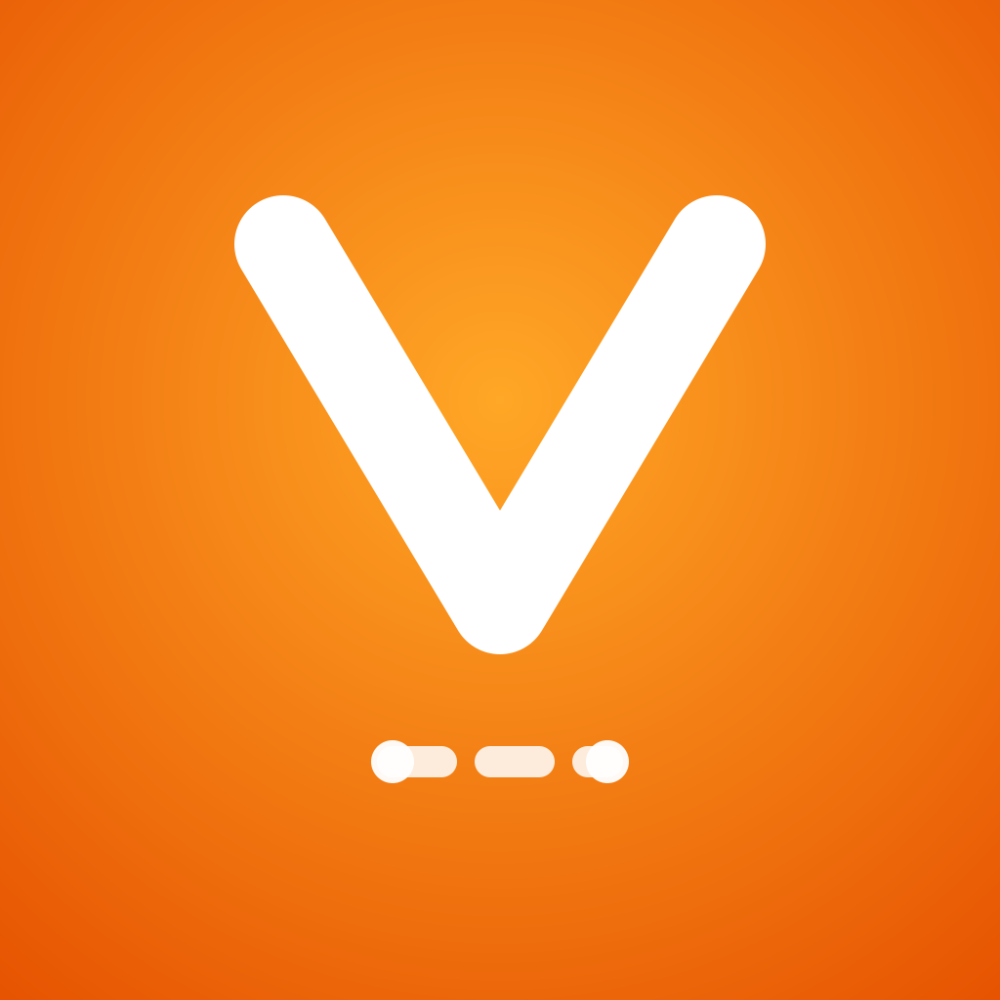
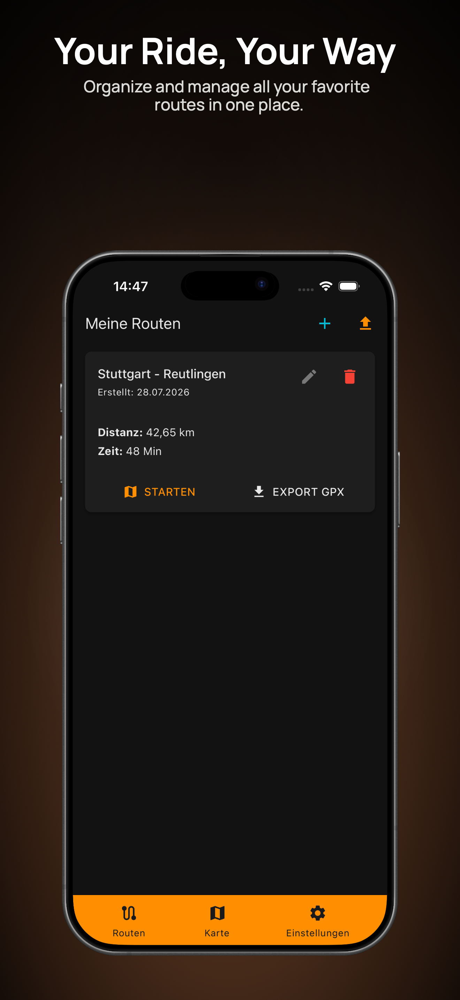
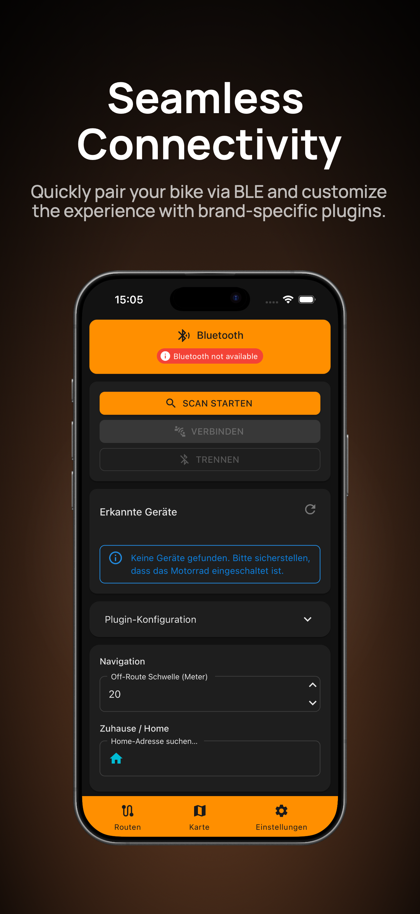
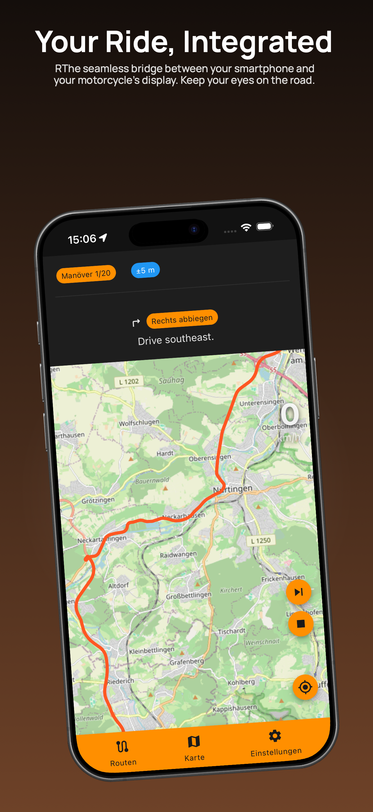
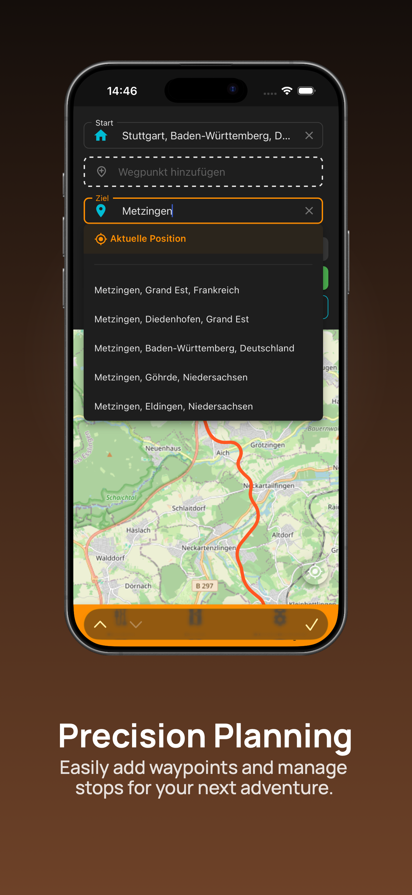

<div align="center">
  
  <h1>VegaBridge</h1>
  <p><strong>Motorcycle navigation for MV Agusta —<br>turn-by-turn on your bike's dashboard via BLE</strong></p>

  <p>
    
    
    
    
  </p>
</div>

---

## Gallery

<table>
  <tr>
    <td width="25%"></td>
    <td width="25%"></td>
    <td width="25%"></td>
    <td width="25%"></td>
  </tr>
  <tr align="center">
    <td><strong>🗺️ Interactive Map</strong><br>With route planning & search</td>
    <td><strong>🧭 Navigation</strong><br>Turn‑by‑turn with live instructions</td>
    <td><strong>📋 My Routes</strong><br>Save, load, import & export GPX</td>
    <td><strong>⚙️ Settings</strong><br>BLE device & connection management</td>
  </tr>
</table>

---

## Features

- **🗺️ Interactive Map** — Powered by OpenLayers with smooth pan/zoom, route preview, and GPS breadcrumb trail.
- **🧭 Turn-by-Turn Navigation** — Routes calculated via [Valhalla](https://github.com/valhalla/valhalla) (OpenStreetMap data). Clear step‑by‑step instructions, distance, and ETA.
- **🏍️ BLE to Dashboard** — Connects to MV Agusta motorcycles via Bluetooth Low Energy. Sends turn instructions directly to the bike's dashboard using the proprietary MV Agusta protocol.
- **📍 Real‑Time GPS** — Background location tracking with Shiny.Locations. Accurate position on map and automatic navigation state machine.
- **💾 Route Management** — Save and load your favorite routes. Full [GPX](https://en.wikipedia.org/wiki/GPS_Exchange_Format) import and export support.
- **🌙 Dark Mode** — Adapts to system appearance automatically (iOS / macOS).
- **📱 Platform** — Designed for iPhone / iOS.
- **🚧 Road Closures** — Real-time warnings via Overpass API (global) and MobiData (BW, Germany).
---

## Tech Stack

| Area              | Technology                                                                   |
|-------------------|------------------------------------------------------------------------------|
| **Framework**     | .NET 10 · MAUI · Blazor Hybrid                                              |
| **UI**            | [MudBlazor](https://mudblazor.com/) · MudExtensions · CommunityToolkit.Maui |
| **Maps**          | [OpenLayers.Blazor](https://github.com/achavez99/OpenLayers.Blazor)         |
| **BLE**           | [Shiny.BluetoothLE](https://github.com/shinyorg/shiny)                      |
| **GPS**           | [Shiny.Locations](https://github.com/shinyorg/shiny)                        |
| **Routing**       | Valhalla (via `valhalla1.openstreetmap.de`) · Photon Geocoding               |
| **Logging**       | Serilog                                                                      |
| **HTTP**          | `IHttpClientFactory` with Polly resilience pipelines                         |

---
## Project Focus

VegaBridge is primarily designed for **MV Agusta** motorcycles. While the plugin architecture allows for other manufacturers, current development focuses on the MV Agusta protocol.

**Dashboard-First Philosophy**: The goal is to provide navigation instructions on the bike's dashboard. For high-end smartphone map visualization, established navigation apps are superior; VegaBridge focuses on the bridge to the hardware. Future expansion depends on community growth.

---

## Architecture

VegaBridge follows a **plugin architecture** for BLE communication:

```
BleManagerService          ← Central coordinator
  ├── MvAgustaBlePlugin   ← Handles MV Agusta protocol frames
  └── ...                 ← Future manufacturers (extensible via IBleDevicePlugin)
```

The `IBleDevicePlugin` interface allows supporting additional motorcycle brands with their own BLE service UUIDs, frame formats, and handshake sequences — no changes needed to the core service.

Navigation uses a **deterministic state machine** (`NavigationService`) that reacts to GPS position changes and triggers re‑routing when the rider deviates from the planned path.

---
## Download
Join the beta via TestFlight: [Link Placeholder]
## Building

```bash
# Clone the repository
cd VegaBridge

# Build for iOS Simulator (debug)
dotnet build src/VegaBridgeApp -f net10.0-ios

# Release build for iOS (requires signing)
dotnet build src/VegaBridgeApp -f net10.0-ios -c Release

# Create IPA for App Store distribution
dotnet publish src/VegaBridgeApp -f net10.0-ios -c Release
```

> **Note:** Release builds require a valid Apple Distribution certificate and provisioning profile configured in the `.csproj` (`CodesignKey` / `CodesignProvision`).

---
## Contributions
Interested in adding support for other motorcycle brands? Check out the `IBleDevicePlugin` interface to implement a new manufacturer protocol.
---
## License

MIT
