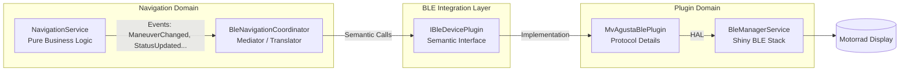

# Implementierungsplan: Navigation ↔ BLE Architektur-Brücke

**Datum:** 2026-06-17  
**Status:** In Progress (Phase 1-5 complete, Phase 6 pending)  
**Autor:** KI-Architekt  
**Betroffene Komponenten:** `NavigationService`, `BleManagerService`, `MvAgustaBlePlugin`, neue `BleNavigationCoordinator`

---

## 1. Problemstellung (Ausgangslage)

Die Analyse hat folgende kritische Lücken im Datenfluss offenbart:

1.  **Missing Link**: Der `NavigationService` feuert Events (`ManeuverChanged`, `StatusUpdated`, `NavigationStateChanged`), aber **keine Komponente** übersetzt diese in tatsächliche BLE-Befehle an das Motorrad. Aktuell wird nur simuliert (`BleCommandSimulated`).
2.  **Protocol Leakage**: Der `NavigationService` enthält Protokoll-spezifischen Code (`BuildBleFrame`, `MapValhallaToMvAgusta`, `\r`/`\x1E` Framing). Dies verletzt *Separation of Concerns* und verhindert die Unterstützung weiterer Hersteller (KTM, BMW, etc.).
3.  **String-Typing**: Die Kommunikation zwischen Schichten basiert auf "Magic Strings" (`"NAVI"`, `"SM"`), was refactoring-unsicher ist.
4.  **Fehlende Abstraktion**: `IBleDevicePlugin` definiert nur ein generisches `SendAsync(string command, ...)`, keine semantischen Navigations-Befehle.

---

## 2. Zielarchitektur (Target State)



**Prinzipien:**
*   **NavigationService**: Kennt **keine** BLE-Details, UUIDs, Byte-Formate oder Hersteller.
*   **BleNavigationCoordinator**: Einzige Stelle, die Navigation-Events in Plugin-Aufrufe übersetzt.
*   **IBleDevicePlugin**: Definiert **semantische** Verträge (`SendNavigationUpdate`, `SendNavigationStart`).
*   **MvAgustaBlePlugin**: Kapselt **ausschließlich** das MV Agusta Protokoll (Framing, Icons, Encoding).

---

## 3. Detaillierter Arbeitsplan

### Phase 1: Contracts & Shared Models (Foundation)

#### 1.1 Neue Datei: `src/VegaBridgeApp/Models/BLE/NavigationBleModels.cs`
**Zweck:** Entkoppelung der Domänen. Der `NavigationService` referenziert diese Models nicht; der Coordinator mapped darauf.

**Inhalt:**
```csharp
// Input für Plugin: Navigations-Update
public record NavigationUpdateInput(
    string ManeuverIcon,      // z.B. "turn-left", "roundabout-right-1"
    string InstructionText,   // z.B. "Rechts abbiegen auf B31"
    string StreetName,        // z.B. "B31"
    double DistanceToTurnM,   // Meter bis zum Abbiegen
    double SpeedKmh,          // Aktuelle Geschwindigkeit
    double RemainingDistanceKm,
    double RemainingTimeMin,
    int CurrentManeuverIndex,
    int TotalManeuvers
);

// Input für Plugin: Navigation Start
public record NavigationStartInput(
    List<NavigationUpdateInput> UpcomingManeuvers, // Optional: Preview für Bike
    double TotalDistanceKm,
    double TotalTimeMin
);

// Input für Plugin: Off-Route
public record OffRouteAlertInput(double DistanceMeters, double Lat, double Lon);
```

#### 1.2 Erweiterung: `src/VegaBridgeApp/Services/BLE/IBleDevicePlugin.cs`
**Änderung:** Interface um semantische Methoden erweitern. `SendAsync` bleibt für Raw-Tests erhalten.

```csharp
// NEU: Semantische Navigation-Methoden
Task SendNavigationStartAsync(IBleConnectedDevice device, NavigationStartInput input);
Task SendNavigationUpdateAsync(IBleConnectedDevice device, NavigationUpdateInput input);
Task SendNavigationFinishAsync(IBleConnectedDevice device);
Task SendOffRouteAlertAsync(IBleConnectedDevice device, OffRouteAlertInput input);
```

---

### Phase 2: Plugin-Implementierung (MV Agusta)

#### 2.1 Refactoring: `src/VegaBridgeApp/Services/BLE/Plugins/MvAgustaBlePlugin.cs`
**Entfernen:**
*   `BuildFrame` (wird privat in den neuen Methoden genutzt).
*   `SimulateBleCommands` Logik (gehört nicht hierher).
*   Abhängigkeit zu `NavigationService` Models.

**Implementieren (Interface-Erfüllung):**
*   `SendNavigationStartAsync` → Baut `NAVI` Frame mit "Start"-Icon + initiale `SM` Frames.
*   `SendNavigationUpdateAsync` → Baut `NAVI` (bei Manöverwechsel) + `SM` (periodisch) Frames.
    *   **Mapping Logik**: `ValhallaType` (int) → `MV Icon String` wandert **hierher** (aus `NavigationService` entfernt).
*   `SendNavigationFinishAsync` → Sendet `FINISH` Frame.
*   `SendOffRouteAlertAsync` → Sendet `ALERT` oder spezielles `NAVI` Frame.

**Protokoll-Details (bleiben privat):**
*   Frame-Format: `\r<CMD>\x1E<field1>\x1E<field2>...\r`
*   Encoding: UTF-8
*   Characteristic UUIDs: `ControlWriteCharacteristicUuid`

---

### Phase 3: Der Mediator (Core Integration)

#### 3.1 Neue Datei: `src/VegaBridgeApp/Services/BLE/BleNavigationCoordinator.cs`
**Verantwortung:** Event-basierte Brücke zwischen Navigation & BLE.

**Struktur:**
```csharp
public sealed class BleNavigationCoordinator : IAsyncDisposable
{
    private readonly NavigationService _navigation;
    private readonly BleManagerService _bleManager;
    private readonly ILogger<BleNavigationCoordinator> _logger;
    private IDisposable? _subscriptions;

    public BleNavigationCoordinator(NavigationService navigation, BleManagerService bleManager, ILogger<BleNavigationCoordinator> logger) { ... }

    public Task StartAsync() 
    {
        // 1. Subscriptions aufbauen
        // 2. State prüfen (bereits verbunden?)
        // 3. Initialen State syncen
    }

    // Handler für Navigation Events:
    private void OnNavigationStateChanged(bool isNavigating) { ... }
    private void OnManeuverChanged(NavigationManeuverInfo info) { ... }
    private void OnStatusUpdated(NavigationStatus status) { ... }
    private void OnOffRouteDetected(double lat, double lon, double distM) { ... }
    private void OnNavigationCompleted() { ... }

    // Helper: Sicherer Aufruf Plugin
    private async Task TrySendAsync(Func<IBleDevicePlugin, IBleConnectedDevice, Task> action) { ... }

    public async ValueTask DisposeAsync() { _subscriptions?.Dispose(); }
}
```

**Wichtige Implementierungsdetails:**
*   **Null-Safety**: Prüft `_bleManager.IsAnyDeviceConnected` und aktives Plugin vor jedem Senden.
*   **Throttling**: `StatusUpdated` feuert ~1Hz. Coordinator darf **nicht** jedes Event 1:1 an BLE weiterleiten (Flooding). Implementierung: `SM` Frames nur alle 500ms oder bei Delta > X% senden. `NAVI` Frames sofort bei `ManeuverChanged`.
*   **Error Handling**: Exceptions im Plugin-Call fangen, loggen, an `BleManagerService.ErrorMessages` weiterleiten (UI Feedback).
*   **Thread-Safety**: Events kommen evtl. von GPS-Thread. `BleManagerService` Calls sind thread-sicher (Shiny), aber Coordinator State (z.B. Throttling-Timer) muss `lock`/`ConcurrentDictionary` nutzen.

---

### Phase 4: Bereinigung NavigationService (Debt Removal)

#### 4.1 Datei: `src/VegaBridgeApp/Services/Navigation/NavigationService.cs`
**Entfernen:**
*   `public event Action<string, byte[]>? BleCommandSimulated;`
*   `private void SimulateBleCommands(...)`
*   `private static byte[] BuildBleFrame(...)`
*   `private static string MapValhallaToMvAgusta(int valhallaType)` → **Logik wandert nach `MvAgustaBlePlugin`**

**Beibehalten / Anpassen:**
*   `NavigationManeuverInfo.BLEIcon` Property: 
    *   *Option A (Empfohlen)*: `NavigationService` liefert **nur** `ValhallaType` (int). `NavigationManeuverInfo` bekommt `int ValhallaType`. Der **Coordinator/Plugin** macht das Mapping.
    *   *Option B*: `NavigationService` mappt auf **herstellerneutrale** Icon-Namen (z.B. `turn_left`, `roundabout_right_1`). Plugin mappt dann auf Hersteller-Spezifika.
    *   *Entscheidung*: **Option A** ist sauberster. `NavigationManeuverInfo` bekommt `int ValhallaType`. `BLEIcon` Property wird entfernt.

---

### Phase 5: Dependency Injection & Bootstrap

#### 5.1 Registrierung: `src/VegaBridgeApp/MauiProgram.cs`
```csharp
// ... existing ...
builder.Services.AddSingleton<NavigationService>();
builder.Services.AddSingleton<BleManagerService>();
builder.Services.AddTransient<IBleDevicePlugin, MvAgustaBlePlugin>();

// NEU: Coordinator als Singleton (hält State/Subscriptions)
builder.Services.AddSingleton<BleNavigationCoordinator>();
```

#### 5.2 Initialisierung: `src/VegaBridgeApp/App.xaml.cs` (oder `MainPage.xaml.cs`)
```csharp
protected override async void OnStart() // oder OnAppearing
{
    base.OnStart();
    
    // Coordinator auflösen und starten
    // Achtung: MauiProgram.CreateMauiApp() baut den Container. 
    // Zugriff via IServiceProvider.
    var coordinator = Handler.Resolve<BleNavigationCoordinator>(); 
    // oder über DependencyInjection in Page/ViewModel
    await coordinator.StartAsync();
}
```
*Hinweis:* In MAUI/Blazor Hybrid am besten im `MainLayout` oder `App.razor` via `@inject` und `OnInitializedAsync` starten.

---

### Phase 6: Validierung & Test-Strategie

| ID | Szenario | Test-Art | Kriterium |
|----|----------|----------|-----------|
| T01 | Navigation Start (Bike verbunden) | Integration / Manuell | `SendNavigationStartAsync` + `SendNavigationUpdateAsync` werden 1x aufgerufen. Logs zeigen `NAVI` + `SM` Frames. |
| T02 | Manöverwechsel | Unit Test (Mock NavigationService) | `ManeuverChanged` Event → Coordinator ruft `SendNavigationUpdateAsync` mit neuem Icon auf. |
| T03 | Periodic Status Update (Throttling) | Unit Test | 10 `StatusUpdated` Events in 1s → max 2 `SendNavigationUpdateAsync` Calls (SM Only). |
| T04 | Re-Routing (`Reroute` Call) | Integration | `Reroute` → `ManeuverChanged` (Index 0) → Plugin Update. Altes Manöver nicht mehr gesendet. |
| T05 | Off-Route Detection | Unit Test (Mock GPS) | `OffRouteDetected` Event → `SendOffRouteAlertAsync` Call. |
| T06 | Ziel erreicht | Integration | `NavigationCompleted` → `SendNavigationFinishAsync` → `StopNavigation`. |
| T07 | Kein Bike verbunden | Unit Test | Events feuern, Coordinator loggt `Debug` ("No device connected"), **keine** Exception, **kein** Plugin Call. |
| T08 | Plugin Exception Handling | Unit Test (Mock Plugin throws) | Exception wird geloggt, `BleManagerService.ErrorMessages` erhält Entry, App stürzt nicht ab. |
| T09 | Disconnect während Navigation | Integration | Bike trennt Verbindung → `BleManagerService` State `Idle` → Coordinator stoppt Senden. Reconnect → Resume. |

---

## 4. Risiken & Gegenmaßnahmen

| Risiko | Eintrittswahrscheinlichkeit | Auswirkung | Mitigation |
|--------|----------------------------|------------|------------|
| **Race Condition**: GPS Event vor BLE Connect | Hoch | Mittel | Coordinator prüft `IsAnyDeviceConnected` & `_activePlugin != null` in `TrySendAsync`. Early Events verwerfen oder puffern (Optional: `ConcurrentQueue` + `ProcessQueue` bei Connect). |
| **BLE Flooding** (1Hz Status → Write) | Hoch | Hoch (Bike Buffer Overflow) | **Muss** in Coordinator implementiert werden: Throttling für `SM` (Status/Motion) Frames. `NAVI` (Manöver) sofort. |
| **Zirkelabhängigkeit** (Plugin kennt Navigation Models) | Niedrig | Hoch | `NavigationBleModels.cs` in `Models/BLE` (Shared Kernel). `NavigationService` referenziert **nicht** `Models/BLE`. |
| **Mapping Valhalla → MV Agusta unvollständig** | Mittel | Mittel | Mapping-Tabelle in `MvAgustaBlePlugin` als `static readonly Dictionary<int, string>` pflegen. Unit Tests für alle Valhalla-Typen (1-16). |
| **Threading Issues** (GPS Thread → UI/ble Thread) | Mittel | Mittel | `BleManagerService` nutzt Shiny (thread-safe). Coordinator State (Throttling Timer) mit `lock` oder `System.Threading.Channels` schützen. |

---

## 5. Aufwandsschätzung (Rough Estimate)

| Phase | Aufwand (Personentage) | Kommentar |
|-------|------------------------|-----------|
| Phase 1: Contracts/Models | 0.5 | Rein typsicher, wenig Logik. |
| Phase 2: Plugin Refactoring | 1.0 | Protokoll-Logik sauber kapseln, Mapping-Tabelle pflegen. |
| Phase 3: Coordinator | 1.5 | Kernlogik: Event-Handling, Throttling, Error-Handling, Lifecycle. |
| Phase 4: Cleanup NavigationService | 0.5 | Löschen von Code, Tests anpassen. |
| Phase 5: DI & Bootstrap | 0.2 | Registrierung, Startup-Logik. |
| Phase 6: Tests & Verifikation | 1.0 | Unit Tests (xUnit/Moq), Manuelle BLE-Tests. |
| **Summe** | **~4.7 Tage** | Puffer für Unvorhergesehenes: **+1-2 Tage**. |

---

## 6. Definition of Done (DoD)

1.  [ ] `NavigationService` kompiliert **ohne** Verweise auf `System.Text.Encoding`, `byte[]` Framing, `MapValhallaToMvAgusta`, `BleCommandSimulated`.
2.  [ ] `IBleDevicePlugin` definiert 4 semantische Methoden (`Start`, `Update`, `Finish`, `OffRoute`).
3.  [ ] `MvAgustaBlePlugin` implementiert Interface vollständig, alle Protokoll-Details (`\r`, `\x1E`, Icons) sind **privat**.
4.  [ ] `BleNavigationCoordinator` subscribt alle relevanten Events, transformiert DTOs, ruft Plugin auf.
5.  [ ] Throttling für `StatusUpdated` (SM Frames) implementiert (z.B. min 500ms Intervall).
6.  [ ] Coordinator in DI registriert und beim App-Start gestartet (`StartAsync`).
7.  [ ] Unit Tests für Coordinator (Mocks) und Plugin Mapping existieren und sind grün.
8.  [ ] Manuelle Verifikation am Motorrad (oder BLE Sniffer): Navigation Start → Manöver → Ziel erreicht funktioniert ohne App-Absturz.

---

## 7. Nächste Schritte (Sofort-Aktion)

> **Entscheidung erforderlich:** Soll ich mit **Phase 1 (Contracts & Models)** beginnen?  
> Falls ja, erstelle ich:
> 1. `src/VegaBridgeApp/Models/BLE/NavigationBleModels.cs`
> 2. Aktualisiere `src/VegaBridgeApp/Services/BLE/IBleDevicePlugin.cs`

Bitte bestätigen oder Änderungen am Plan angeben.